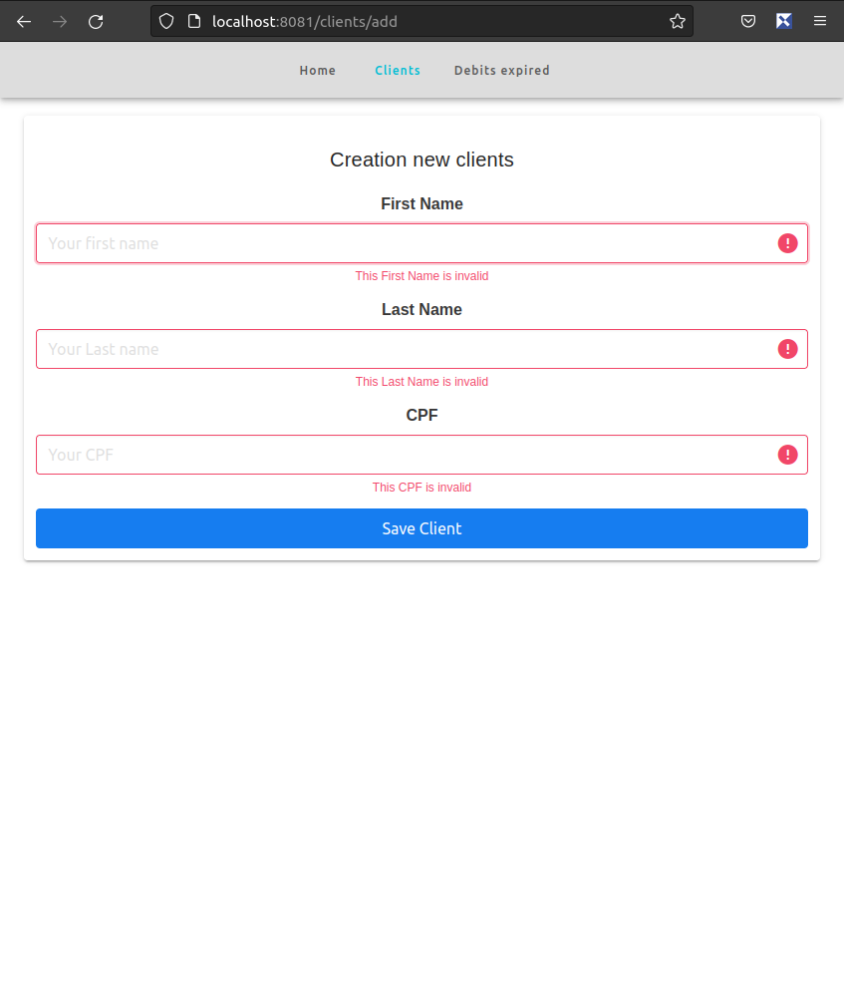
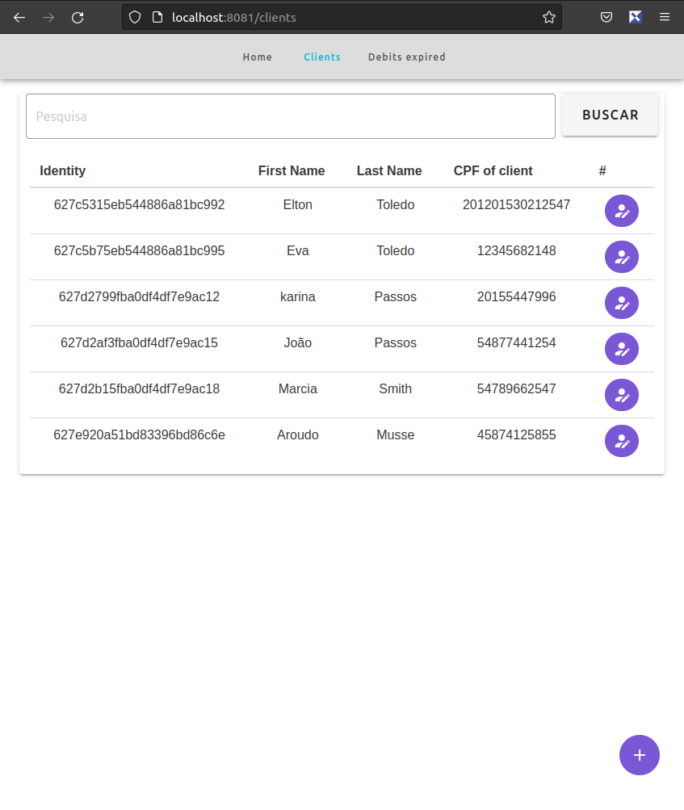
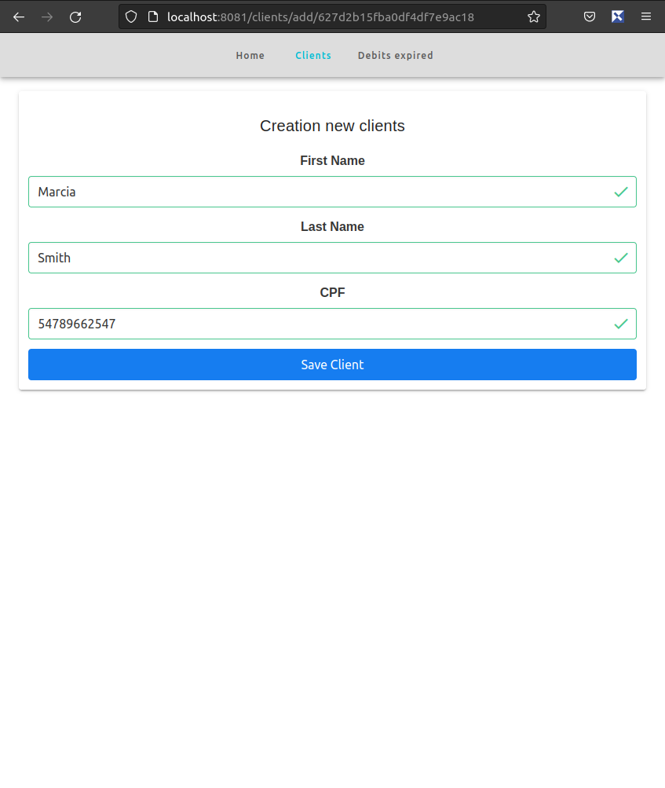

# Esta Aplicação foi desenvolvida para o teste de conhecimentos Full-stack da empresa Bluecast Outsorcing.

## Overview
A aplicação está dividida em três container Docker utilizando o Docker compose para a criação, sendo eles 
 - [Api - Aplicação Back-end feita em NodeJs e utilizado:](https://github.com/eltonjtoledo/teste-fullstack-bluecast/tree/main/api)
    - TypeScript
    - ExpressJS
    - mogoose
    - MomentJs
    - Expondo a porta 3000

 - [Web - Aplicação Front-end feita com VueJs e utilizando:](https://github.com/eltonjtoledo/teste-fullstack-bluecast/tree/main/web)
    - Axios
    - Vue Roter
    - Vuetify
    - Expondo a porta 8080 
    - Database - Servidor do banco de dados MongoDB.
    - Expondo a porta 27017

## Obsevações

Para o funcionamento desta aplicação é necessario a preexistencia do Docker na maquina.

o Arquivo clients.txt disponivel na raiz do projeto, contem um lista de registros que podem ser importados a Collection clients.

## ScreenShots

   
   
   

